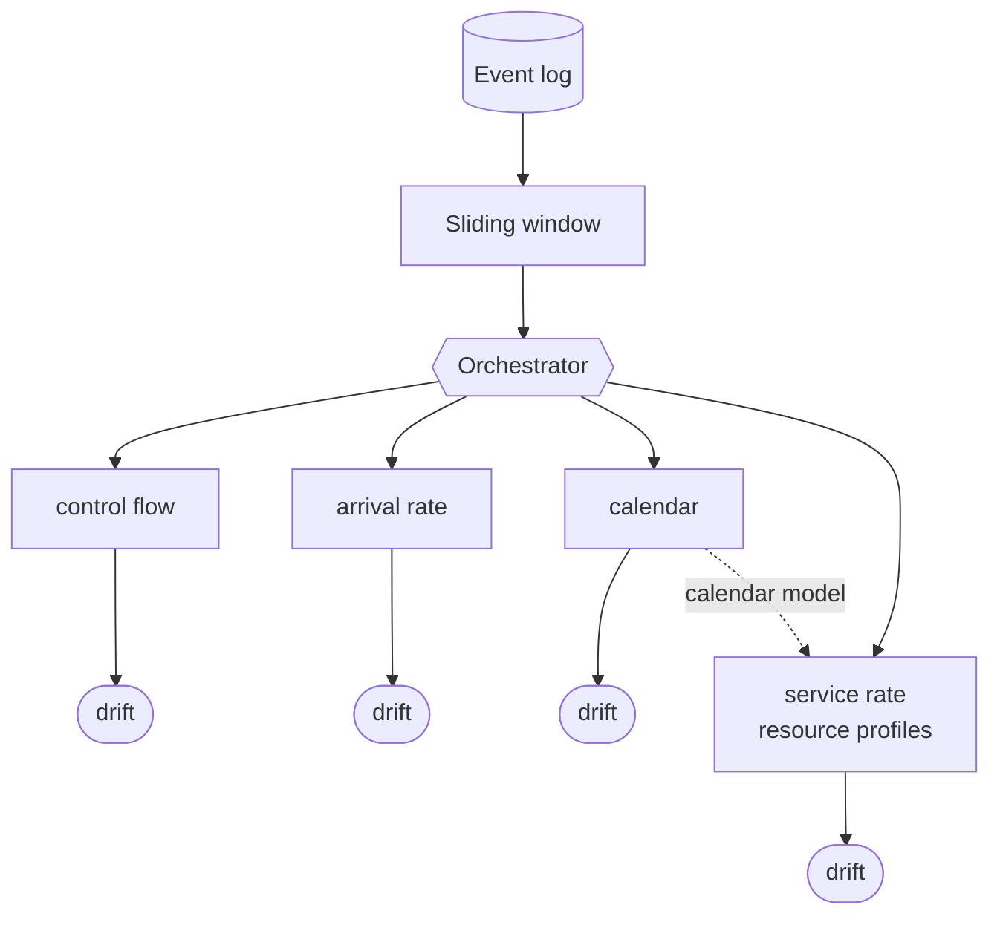
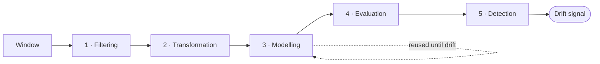

# Multiperspective Drift Detection

**A modular framework for detecting *concept drift* in business processes across five perspectives —
not just control flow.**

[](https://www.python.org/)
[](LICENSE)
[](https://pm4py.fit.fraunhofer.de/)

*Bachelor's thesis, Universidade de Santiago de Compostela (2026).*
🇪🇸 [Documentación completa en español](README.es.md)

---

## Table of contents

- [The problem](#the-problem)
- [What this framework does](#what-this-framework-does)
- [The five perspectives](#the-five-perspectives)
- [Architecture](#architecture)
- [How detection works](#how-detection-works)
- [Relevance to time-series regime detection](#relevance-to-time-series-regime-detection)
- [Installation](#installation)
- [Quickstart](#quickstart)
- [Configuration](#configuration)
- [Results and validation](#results-and-validation)
- [Limitations and future work](#limitations-and-future-work)
- [Project layout](#project-layout)
- [Credits and provenance](#credits-and-provenance)

---

## The problem

### What is an event log?

Organisations run *processes*: a loan application, an insurance claim, a hospital admission. Every
time a process runs, the IT systems supporting it leave a trail. That trail is an **event log**: a
table where each row is one activity performed by one resource at one point in time, and rows are
grouped into **traces** (also called cases) — one complete execution of the process.

| Case ID | Activity | Resource | Available | Start | End |
|---|---|---|---|---|---|
| 1 | A | R1 | 2026-06-15 08:45 | 2026-06-15 09:00 | 2026-06-15 09:15 |
| 1 | B | R2 | 2026-06-15 09:15 | 2026-06-15 09:20 | 2026-06-15 10:00 |
| 1 | C | R3 | 2026-06-15 10:00 | 2026-06-15 10:05 | 2026-06-15 10:30 |
| 2 | A | R2 | 2026-06-15 10:40 | 2026-06-15 10:45 | 2026-06-15 11:00 |
| 2 | B | R1 | 2026-06-15 11:00 | 2026-06-15 11:05 | 2026-06-15 11:50 |

**Process mining** is the discipline that reconstructs, checks and improves a process from these logs
instead of from an *a priori* design.

### What is concept drift?

Process mining algorithms traditionally treat a process as a static object. Real processes are not.
They adapt to their context constantly:

- someone goes on sick leave and the workload shifts onto their colleagues;
- customers start demanding service at different hours;
- new legislation adds a mandatory check that slows everything down.

So a model discovered from historical data **can stop describing reality**. This is **concept drift**,
and detecting it is a prerequisite for trusting anything else process mining tells you: a bottleneck
analysis or a remaining-time prediction built on a stale model is worse than no analysis at all.

### Why five perspectives instead of one

Almost all of the concept-drift literature looks only at **control flow** — the order in which
activities execute. But a process is much more than an activity sequence: it involves resources with
their own working calendars, availability levels, utilisation rates, and case arrival and completion
dynamics. A change in any of those is a real change in the process, and control flow will not see it.

Approaches that do go beyond control flow exist — the most notable being **Dynamik**, which starts
from a rich taxonomy of dimensions — but they are very sensitive to oscillations. **A robust
multiperspective approach was missing. That is the gap this work addresses.**

---

## What this framework does

Given one event log, it monitors it simultaneously from **five perspectives**, each using whatever
modelling technique suits it, and raises an independent drift signal per perspective — while
resolving the data dependencies between them.

- **Heterogeneous by design.** Petri nets, Random Forest regressors, fuzzy calendars and
  distribution fitting coexist under a single orchestration core.
- **Modular and extensible.** A registry pattern means adding a perspective, metric, model or filter
  never requires touching the core.
- **Configuration-driven.** Everything is declared in YAML; no code changes to run an experiment.
- **Dependency-aware.** Resource productivity and utilisation need resource calendars, so the
  `calendar` perspective propagates its model to them and the scheduler enforces the ordering.
- **Self-tuning windows.** Window size, stride and detector parameters can be calibrated
  automatically from the log.

### What's novel here

The detection scheme builds on **C2D2**, a control-flow drift detector, and adds three contributions:

1. **Streak invalidation on slope reversal.** If a trend flips direction (rising, then falling), the
   candidate is discarded rather than accumulated — the metric was oscillating, not drifting.
   ([`concept_drift_detection.py`](src/concept_drift_detection.py))
2. **Post-drift burn-in.** After confirming a change, detection is suspended for a number of
   iterations while the re-mined model stabilises, so the transient values a metric takes while
   moving from the old regime to the new one cannot themselves trigger a spurious detection.
3. **Generic change localisation** on the window that started the streak, shared by every metric.
   This is what makes the detector metric-agnostic — and, as the results below show honestly, it is
   also the reason the detection *delay* is larger than C2D2's.

---

## The five perspectives

| Perspective | What it models | Technique | Metric | Drift signal |
|---|---|---|---|---|
| **Control flow** | Order and dependencies between activities | Inductive Miner / Heuristic Miner → Petri net | `fitness`, `precision` | ↓ fitness (new behaviour appears) · ↓ precision (old behaviour disappears) |
| **Arrival rate** | Rate at which new cases enter | Random Forest + cyclical encoding and lag features | `MAE` / `MSE` | ↑ prediction error |
| **Service rate** | Rate at which cases complete | Same, applied to the last activity of each trace | `MAE` / `MSE` | ↑ prediction error |
| **Calendar** | Working hours of each resource | Fuzzy resource calendars (pix-framework) | `support`, `inverted support` | ↓ support (shift extended) · ↓ inverted support (shift reduced) |
| **Resource profiles** | Productivity and utilisation per resource | Distribution fitting by AIC · Resource Utilisation Index | Wasserstein distance, `utilization` | ↑ distance from reference · ↑ utilisation |

### What the metrics actually mean

- **fitness** — the fraction of traces in the log that the model can reproduce. If a once-mandatory
  fragment becomes optional, traces start taking a path the model does not allow, and fitness falls
  *gradually* as more of them enter the window.
- **precision** — the fraction of the behaviour the model permits that is actually observed. If two
  concurrent fragments start running sequentially, the model still allows the parallel order that no
  longer occurs, so precision falls while fitness stays flat.
- **support** — the fraction of events covered by the discovered calendar.
  **inverted support** — the fraction of calendar intervals backed by actual events. The pair is
  complementary: *reducing* a shift leaves calendar intervals unsupported (inverted support drops,
  support does not), whereas *extending* one produces events outside the calendar (support drops,
  inverted support does not).
- **RPD** (Resource Performance Deviation) — how fast a resource is at a task relative to that task's
  average duration. It is not a scalar but a **distribution**, one value per execution, compared
  against its reference with the Wasserstein distance.
- **RUI** (Resource Utilisation Index) — the share of a resource's available time that it spends
  working.

---

## Architecture

The core is an orchestrator that slides a window over the log. At each step it launches the
perspectives the user enabled; each one runs its own five-stage pipeline independently and emits its
own drift signal. The orchestrator is agnostic to the concrete operations — it resolves them at
runtime against a registry — so perspectives and techniques can be added without modifying it.



Every perspective runs the same five-stage pipeline over its window, independently of the others:



| Stage | Responsibility |
|---|---|
| **1 · Filtering** | Select the rows and columns the perspective needs; discard the rest. |
| **2 · Transformation** | Derive the features needed to build and evaluate the model. |
| **3 · Modelling** | Build the perspective's model — on the first window, and again after a confirmed drift. |
| **4 · Evaluation** | Compute one or more metrics over the model and the transformed window. |
| **5 · Detection** | Watch the metrics over time and decide whether a drift occurred. |

Only two things survive between iterations: the model and the metric history. Everything else is
recomputed, which is what keeps the stages independent.

### Window modes

A window can be defined by **events**, by **traces** or by **time**, and is controlled by three
parameters: *size*, *stride* and *start*. Windows can be shared by all perspectives (**uni-window**)
or private to each one (**multi-window**).

Multi-window matters because perspectives operate at genuinely different granularities: a calendar
change unfolds over months, a control-flow change over days. The scheduler uses a **minimum-end**
rule — at each tick only the perspectives whose window closes earliest advance:

```
                 ▲ CF advances    ▲ CF advances    ▲ both advance
                 │                │                │
control flow  ├──[0,30]──┤├──[30,60]─┤├──[60,90]─┤├──[90,120]─┤
 (30d window)
calendar      ├────────────[0,90]────────────────┤├──[90,180]…
 (90d window)
              └─────┴─────┴─────┴─────┴─────┴─────┴──────────▶
              0     15    30    45    60    75    90        days
```

Control flow advances alone at days 30 and 60 while calendar waits in place; at day 90 both windows
close together and both advance. In multi-window mode all windows must be temporal and use
constant-duration units (seconds, minutes, hours, days, weeks) so that advancing is deterministic.

---

## How detection works

The same detector serves every perspective, which is what makes the framework metric-agnostic. It
watches a scalar metric over time and asks whether it is *degrading systematically* rather than
merely fluctuating:

1. **Candidate.** Fit a linear regression over the last `n_regresion` values of the metric. If the
   slope is statistically significant (*p* < 0.05), mark the window as a drift candidate.
2. **Streak.** A candidate whose slope reverses direction breaks the streak and is discarded.
3. **Confirmation.** If the last `n_confirmacion` windows are all candidates, confirm the drift, and
   attribute it to the window where the streak began.
4. **Recovery.** Re-mine the model and suspend detection for a burn-in period while it stabilises.

Window and detector parameters are coupled, and can be derived automatically:

```
n_confirmacion = tamano_ventana / salto_ventana        n_regresion = n_confirmacion / 2
```

so that confirmation requires enough iterations for the window to have filled completely with new
traces. With `autoajuste: true` the framework calibrates the window size itself — growing it until
models discovered over three consecutive sub-windows agree — and recalibrates these parameters
accordingly, both at startup and after each confirmed drift.

---

## Relevance to time-series regime detection

Stripped of its process-mining vocabulary, the detector is a **generic regime-change detector on a
scalar metric monitored over a rolling window**, with streak-based confirmation to control false
alarms. The structure maps directly onto non-stationarity detection in financial time series:

| Here | Financial time-series equivalent |
|---|---|
| Sliding window over the event log | Rolling window over the series |
| Reference model (Petri net, Random Forest, calendar) | Model or strategy fitted in-sample |
| Metric degradation (fitness, MAE, Wasserstein) | PnL decay, tracking error, rising forecast error |
| Regression + confirmation streak | Regime-change detection with false-alarm control |
| Streak invalidation on slope reversal | Rejecting mean-reverting noise as a trend |
| Re-mining the model after drift | Retraining / recalibration |
| Delay vs. false-positive trade-off | The same dilemma in model risk management |

Two properties are worth pointing out because they are exactly what matters when the data is
temporal. First, the **delay/precision trade-off is measured, not hidden** — the results below show
this framework matching the state of the art on detection accuracy while being systematically slower
at localisation, and explain why. Second, the arrival- and service-rate models use `TimeSeriesSplit`
for cross-validation and strictly causal lag features, so there is no look-ahead leakage.

---

## Installation

### Prerequisites

- **Python 3.10** (developed and validated on 3.10.19).
- **Graphviz** — required, not optional: the control-flow perspective renders the discovered Petri
  net on every model discovery.
  - macOS: `brew install graphviz`
  - Ubuntu/Debian: `sudo apt-get install graphviz`
  - Windows: [installer](https://graphviz.org/download/)

### Setup

```bash
git clone https://github.com/Gaboguevaram/multiperspective-drift.git
cd multiperspective-drift

conda create -n tfg-mineria python=3.10 -y
conda activate tfg-mineria

pip install -e .          # add ".[dev]" for the notebooks and linters
```

No Prefect server is needed. The framework runs Prefect in ephemeral mode, spinning up a temporary
server for the duration of the run. If you prefer your own, export `PREFECT_API_URL` and it will be
used instead.

---

## Quickstart

Run case **CF-A**: a loan-application log of 5000 traces where, exactly halfway through, a mandatory
fragment becomes optional. The ground truth is a single drift at trace 2500.

```bash
python -m tests.test_perspectivas \
    --log ./data/01_raw/control_flow/single/cb-5000-single.csv \
    --perspectiva control_flow \
    -f ./conf/logs_simples/cf_cb.yml
```

Expected output (**~2 minutes**):

```
Cambios reales esperados: [2500]
Tolerancia admitida: ±250 trazas
Cambios detectados por el algoritmo: [2527]

========================================
      RESULTADOS DEL BENCHMARK
========================================
 Verdaderos Positivos (TP) : 1
 Falsos Positivos     (FP) : 0
 Falsos Negativos     (FN) : 0
----------------------------------------
 Precision : 1.0000
 Recall    : 1.0000
 F-Score   : 1.0000
 Retardo (Δ): 27.00 trazas
========================================
```

The drift is detected at trace **2527**, 27 traces after it was injected — the exact figure reported
in the thesis. The run also writes the discovered Petri nets to `data/06_models/`, a drift summary to
`data/08_reporting/`, and a full trace to `logs/`.

**Just checking the install works?** Copy any config from `conf/logs_simples/`, add `max_iter: 25`
under `configuracion_global`, and run it through `python -m src.main_flow -f <your.yml>`. It finishes
in well under a minute without reaching a drift.

### Reproducing the other cases

Each perspective has a ready-made config in [`conf/logs_simples/`](conf/logs_simples/):

| Config | Log | Case |
|---|---|---|
| `cf_cb.yml` | `cb-5000-single.csv` | CF-A — fragment becomes optional |
| `cf_pl.yml` | `pl-5000-single.csv` | CF-B — concurrent fragments become sequential |
| `ar_a.yml` | `ar_a-5000-single.csv` | AR-A — case arrival rate doubles |
| `sr_a.yml` | `ar_a-5000-single.csv` | SR-A — service rate follows the arrival change |
| `cal_a.yml` | `cal_a-5000-single.csv` | CAL-A — working shift reduced |
| `cal_b.yml` | `cal_b-5000-single.csv` | CAL-B — working shift extended |
| `rp_a.yml` | `rp_a-5000-single.csv` | RP-A — productivity dispersion changes |
| `ru_a.yml` | `ru_a-5000-single.csv` | RU-A — resource utilisation rises |

```bash
python -m src.main_flow -f ./conf/logs_simples/ar_a.yml
```

---

## Configuration

Everything is declared in YAML. A minimal single-perspective run:

```yaml
configuracion_global:
  ruta_log: "./data/01_raw/control_flow/single/cb-5000-single.csv"
  debug: false
  primera_tarea: 'Loan_application_received'
  ultima_tarea: 'Finish_process'
  ventana:
    tipo: 'temporal'          # 'temporal' | 'eventos' | 'trazas'
    tamano_ventana: "3 days"
    salto_ventana: "2 hours"
    fecha_inicial: null
    autoajuste: false

perspectivas:
  - nombre: "control_flow"
    op_filtrado:      ["filtrar_trazas_completas"]
    op_transformaciones: ["transformacion_simple"]
    modelo: "inductive_miner"
    metricas:         ["precision", "fitness"]
    op_det_concept_drift: "deteccion_regresion"
    n_regresion: 70
    n_confirmacion: 140
    avance: "on_trace"        # skip iterations where no new trace entered
```

To run perspectives on independent windows, move the `ventana` block inside each entry of
`perspectivas` — see [`conf/parameters_multi_ventana.yml`](conf/parameters_multi_ventana.yml). The
configuration is validated before execution and rejects incoherent setups (non-temporal windows in
multi-window mode, variable-duration units such as months or years, and so on) with an explicit error.

Adding a new perspective means writing a module under `src/perspectivas/` and registering its
operations in [`src/registro.py`](src/registro.py). The orchestrator needs no changes.

**Full parameter reference:** [README.es.md](README.es.md) (Spanish).

---

## Results and validation

Two complementary experiments, both on synthetic logs with known ground truth. Detection quality is
scored with the F₁-score over drift points, counting a detection as correct if it falls within ±5 %
of the real change point, plus the localisation delay Δ = |*d*ᵣ − *d*ᴅ|.

### 1 · Per-perspective validation

Eight logs of 5000 traces, each with a single sustained change injected at 50 %. Several cases include
a **control element** — a resource or set of tasks that does *not* change — to verify the detector
isolates the change to the affected element. Window and detector parameters were tuned per case with
Optuna against the known ground truth.

| Case | Injected change | Control | Window | Stride | n_reg | n_conf | Detected at |
|---|---|---|---|---|---|---|---|
| CF-A | Mandatory fragment becomes optional | — | 3 d | 2 h | 70 | 140 | **2527** |
| CF-B | Concurrent fragments become sequential | — | 9 h | 4 h | 65 | 130 | **2353** |
| AR-A | Arrival 𝒩(1800,1500) → 𝒩(900,750) s | — | 10 d | 18 h | 35 | 70 | **2570** |
| SR-A | Service rate follows the arrival change | — | 3 d | 2 h | 75 | 150 | **2460** |
| CAL-A | Marta's shift reduced | Carlos | 7 d | 4 h | 75 | 150 | **2694** |
| CAL-B | Marta's shift extended | Carlos | 14 d | 6 h | 55 | 110 | **2716** |
| RP-A | Duration of tasks A, C, E: 𝒩(1000,20) → 𝒩(1000,400) | Tasks B, D | 30 d | 2 d | 40 | 15 | — |
| RU-A | Marta's service time 200 → 340 | Carlos | 10 d | 1 h | 70 | 140 | **2726** |

Every case reacts through *its own* metric and leaves the control element untouched: in CAL-A only
Marta's inverted support moves while Carlos stays flat; in RP-A only tasks A, C and E depart from
their reference while B and D stay at zero.

**RP-A is the honest exception.** No window configuration produced a clean detection. The Wasserstein
signal is clearly visible, but the detector confirms a significant trend *in either direction*, so the
small dips caused by ordinary distribution variability are also read as drift and generate false
positives. The fix — making detection directional per metric, so a distance metric only fires on
increases — is stated as future work rather than papered over.

### 2 · Against the state of the art

Control flow compared against **C2D2** and **Event-Based ProDrift (PD-E)** over the full public
benchmark: 17 change patterns × 4 sizes = 68 logs, 9 recurring drifts each. Averages per log size:

| Traces | Ours F₁ | Ours Δ | C2D2 F₁ | C2D2 Δ | PD-E F₁ | PD-E Δ |
|---|---|---|---|---|---|---|
| 2500 | 0.9752 | 21.2 | **0.9941** | **3.4** | 0.9723 | 49.7 |
| 5000 | 0.9611 | 48.6 | **0.9969** | **3.4** | 0.9692 | 42.3 |
| 7500 | 0.8839 | 84.5 | **0.9706** | **3.2** | 0.9194 | 32.3 |
| 10000 | **0.9661** | 91.3 | 0.9490 | **4.0** | 0.8995 | 36.2 |

**Reading these numbers honestly.** On *detection accuracy* the framework is level with C2D2 and above
PD-E: within a few hundredths on the smaller logs, and ahead of C2D2 at 10000 traces, where C2D2
collapses on specific patterns (`pl` 0.20 and `ORI` 0.13, against 1.00 and 0.95 here). On *localisation*
C2D2 is clearly better — tens of traces of delay against a handful. That gap is a direct consequence of
the generic localisation rule: `precision` only reacts about one window after the change, so a rule
shared by every metric necessarily lags. It buys perspective-agnosticism at the cost of latency.

Full per-pattern results are in Appendix C of the thesis.

### 3 · Distribution-fitting engine — AIC vs KS

The resource-productivity perspective must identify which distribution family generated each
`(resource, task)` pair's values. Validated on 92 pairs with a known generating family:

| Generating family | n | AIC | KS | Δ |
|---|---|---|---|---|
| `norm` | 24 | 100.0 % | 100.0 % | — |
| `uniform` | 18 | 100.0 % | 100.0 % | — |
| `gamma` | 14 | 100.0 % | 100.0 % | — |
| `expon` | 18 | **88.9 %** | 27.8 % | +61.1 pp |
| `lognorm` | 18 | **50.0 %** | 38.9 % | +11.1 pp |
| **Overall** | **92** | **88.0 %** | 73.9 % | **+14.1 pp** |

The entire difference sits in the two families whose identity lives in the right tail. KS mistakes
exponential for gamma in 13 of 18 cases: the exponential is a gamma with shape *k* = 1, so gamma can
always match it using its extra free parameter and shave the maximum distance *D*. KS rewards only
that distance and never penalises complexity, so it systematically prefers the more flexible family.
AIC's `2k` penalty cancels the advantage and gets 16 of 18 right. Hence AIC is the criterion used.

Reproduce with [`tests/resource_productivity/buscar_distribuciones.ipynb`](tests/resource_productivity/buscar_distribuciones.ipynb)
(the notebook explains how to generate its input logs first).

---

## Limitations and future work

- **Window auto-tuning is control-flow only.** The underlying algorithm compares directly comparable
  models such as Petri nets; extending it to the other perspectives would be the single biggest
  improvement.
- **Multi-window mode is restricted to temporal windows**, by design, to keep window arithmetic
  deterministic.
- **Detection is not directional.** A metric confirms a significant trend in either direction, which
  is what costs RP-A a clean detection. Binding each metric to its meaningful direction would fix it.
- **Calendar discovery inherits pix-framework's limitations.** If a window holds insufficient evidence
  that a resource works in a given slot, the calendar will not assert it even when it is real.
- **Partial model discovery.** Resources that appear or disappear mid-log are not tracked.
- **Validation is entirely synthetic.** Real logs bring noise, incompleteness and no ground truth;
  testing against them is the highest-impact next step.
- **New perspectives** such as batching or prioritisation policies would slot into the existing
  architecture without core changes.

---

## Project layout

```
├── conf/                     YAML configurations
│   ├── logs_simples/           per-perspective validation cases
│   └── estado_arte/            state-of-the-art comparison
├── data/                     layered data (01_raw … 08_reporting)
├── src/
│   ├── main_flow.py            orchestrator: uni-window and multi-window
│   ├── ventana.py              the three window modes: extraction and advance
│   ├── ajuste_ventana.py       window auto-tuning and parameter recalibration
│   ├── concept_drift_detection.py   the shared detector
│   ├── metricas.py             every evaluation metric
│   ├── registro.py             operation registry + inter-perspective dependencies
│   ├── config.py               YAML loading, output directories
│   ├── perspectivas/           one module per perspective
│   └── log_generation/         synthetic log generators (ProSimos + BPMN)
└── tests/                    experimental validation scripts (not unit tests)
```

> `tests/` holds the **experimental validation harness** used to produce the results above —
> benchmark runners, Optuna window searches and the distribution-fitting notebook. It is not a pytest
> suite.

---

## Credits and provenance

Built on [pm4py](https://pm4py.fit.fraunhofer.de/) (process discovery and conformance checking),
[pix-framework](https://github.com/AutomatedProcessImprovement/pix-framework) (fuzzy resource calendar
discovery), [ProSimos](https://github.com/AutomatedProcessImprovement/Prosimos) (synthetic log
simulation), [Prefect](https://www.prefect.io/) (orchestration), and the scikit-learn / pandas /
NumPy / SciPy stack.

The control-flow detection scheme derives from **C2D2** by V. J. Gallego Fontenla, one of the thesis
supervisors. The control-flow benchmark logs are a third-party public dataset and are not distributed
here — see [`data/01_raw/control_flow/recurring/README.md`](data/01_raw/control_flow/recurring/README.md).

**Author:** Gabriel Guevara Muradás
**Supervisors:** Juan Carlos Vidal Aguiar, Víctor José Gallego Fontenla, Manuel Lama Penín
**Institution:** Escola Técnica Superior de Enxeñaría, Universidade de Santiago de Compostela, 2026

Licensed under the [MIT License](LICENSE).
